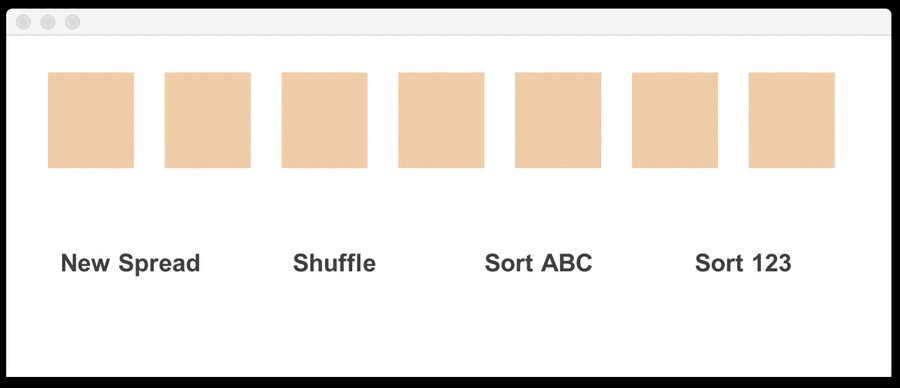
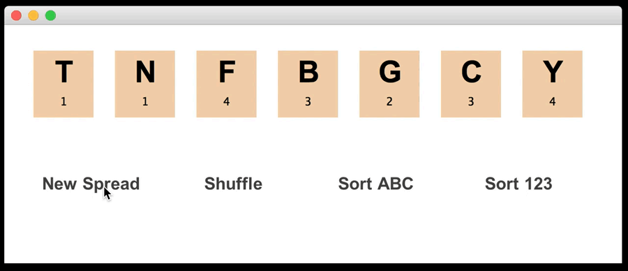
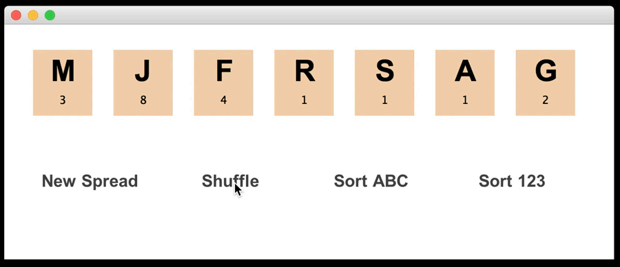
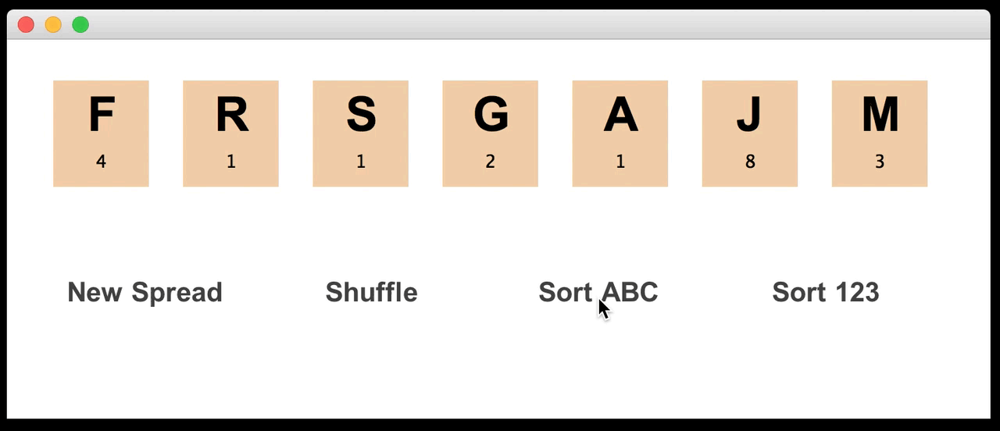
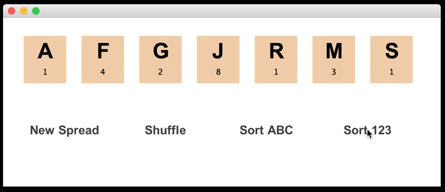

# ScrabbleScrambler
Small java program for practicing lexical decision tasks

New spread:

{:height="50%" width="50%"}

Drag-And-Drop rearranging:

{:height="50%" width="50%"}

Shuffling:

{:height="50%" width="50%"}

Sorting alphabetically:

{:height="50%" width="50%"}

Sorting by score:

{:height="50%" width="50%"}